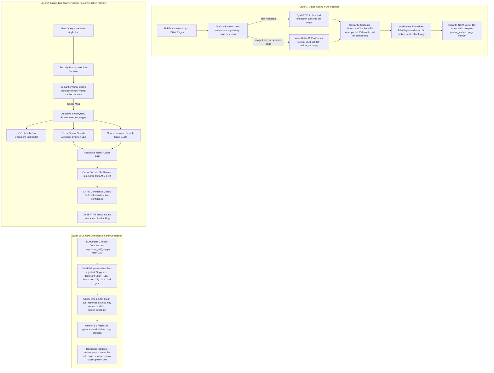

# Enterprise RAG Platform for Large-Scale PDF Documents

A retrieval-augmented generation system for **large PDF corpora (10,000–100,000+ pages)**, combining hybrid dense/sparse search, vision-native page parsing for image-heavy documents, and a community-graph layer for local chunk re-clustering.

> **On the benchmarks below**: All evaluation numbers were produced by a 30-question self-generated dataset judged by Gemini — the same model family used to generate answers. Treat these as internal development signals, not external validation. The [Evaluation Limitations](#-evaluation-limitations) section documents exactly what these numbers do and do not mean.

---

## 📑 Table of Contents
1. [Architecture Overview](#-architecture-overview)
2. [Key Technical Components](#-key-technical-components)
3. [Known Gaps & Planned Improvements](#-known-gaps--planned-improvements)
4. [Internal Benchmark Results](#-internal-benchmark-results)
5. [Evaluation Limitations](#-evaluation-limitations)
6. [Latency Profile](#-latency-profile)
7. [System Components & Repository Structure](#-system-components--repository-structure)
8. [API Microservice Specification](#-api-microservice-specification)
9. [Installation & Setup Guide](#-installation--setup-guide)
10. [Hardware Acceleration](#-hardware-acceleration)
11. [License](#-license)

---

## 🏛️ Architecture Overview

The system is decoupled into an async **FastAPI REST/SSE Microservice Backend** and a **Next.js 15 Tailwind CSS Web Application**.



---

## 🔧 Key Technical Components

### 1. Dual-Path Vision Ingestion (`vision_parser.py` & `ingest.py`)

**What it does**: Text-rich pages are extracted with PyMuPDF (<5ms/page, no API call). Image-heavy or scanned pages (detected by low extractable text + presence of embedded images) are sent to Gemini VLM, which renders the page at 150 DPI and returns layout-aware Markdown preserving tables, charts, and multi-column text.

**Parent-child chunk structure**: Pages are split into 450-word parent chunks. A 150-word child window is extracted from each parent and used for embedding. At retrieval time, the full parent text is returned to the LLM — not the shorter child. This means the retrieval index is dense but the context window receives richer content.

```python
# ingest.py — what gets embedded vs. what gets stored
chunk = {
    "text": child_text,       # 150 words — embedded into the vector index
    "parent_text": parent_text, # 450 words — returned to LLM as context
    "page": page_num + 1,
    "source_tag": f"[Source: Page {page_num + 1}]"
}
```

**Limitation**: The child embedding window (150 words) is fixed, not adaptive. A sentence-level embedding with a page-level parent would likely improve recall on precise factual queries.

### 2. Hybrid Retrieval & Re-Ranking (`nextgen_rag.py`, `query.py`)

- **Dense**: `BAAI/bge-small-en-v1.5` HNSW index (`m=16, ef_construct=100`)
- **Sparse**: Rank-BM25 keyword matching over stored chunk text
- **Fusion**: Reciprocal Rank Fusion (RRF)
- **Cross-encoder re-rank**: `cross-encoder/ms-marco-MiniLM-L-6-v2`
- **Late interaction**: ColBERT v2 MaxSim scoring as final re-rank stage
- **CRAG**: Query confidence check; rewrites query and re-retrieves when all top candidates fall below cross-encoder threshold

**Note on embedding model**: `bge-small-en-v1.5` was chosen for speed and local operation. It has not been benchmarked against alternatives (e.g. `bge-base`, `text-embedding-3-small`, `e5-large`). At 100k-page scale, embedding quality is likely the primary recall ceiling — this deserves an ablation before production use.

### 3. Source Attribution (`query.py`)

Every response includes a `sources` list with page number, rerank score, and the parent chunk text. The LLM system prompt instructs inline citation using `[Source: Page X]` format.

```json
{
  "answer": "The policy was enacted in 2019 [Source: Page 142]...",
  "sources": [
    { "page": 142, "rerank_score": 0.923, "text": "...", "source_tag": "[Source: Page 142]" },
    { "page": 143, "rerank_score": 0.871, "text": "...", "source_tag": "[Source: Page 143]" }
  ],
  "is_cache_hit": false
}
```

**Limitation**: Source attribution is provided to the LLM as context — there is no post-generation step that verifies whether a citation in the answer actually matches the retrieved chunk. A citation-verification pass would catch hallucinated page numbers.

### 4. Self-RAG Directives (`compressor_self_rag.py`)

Injects `[Supported]`, `[Relevant]`, and `[Utility]` as **system prompt instructions** directing the LLM to tag its own claims. This is a generation-time hint, not a verification gate.

**What this is not**: The `[Supported]` token is not parsed from the LLM output and used to block or flag unsupported claims before they reach the user. Claims the LLM marks as `[Not Supported]` still pass through. A genuine groundedness gate would require a separate parsing step on the output, routing flagged claims to a refusal or disclaimer path.

### 5. LLMLingua-2 Context Compression (`compressor_self_rag.py`)

Reduces retrieved context token count by 50% before generation (`compression_rate=0.5`). Faster and cheaper generation, but risks stripping the exact tokens the Self-RAG directives were meant to verify. These two components can work against each other and should be tuned per document type.

### 6. Community Graph Summarization (`leiden_graph.py`)

Builds a greedy modularity community graph over the **retrieved chunks at query time** (not the full corpus). Generates one community summary per cluster and appends it to the generation context.

**What this is and is not**: This provides local re-clustering of the top-k retrieved results — useful for grouping related retrieved passages. It is **not** corpus-level cross-document synthesis, which would require building and indexing the entity graph at ingest time. The current implementation does not persist the graph between queries.

---

## 🚧 Known Gaps & Planned Improvements

These are documented gaps — not claimed to be solved.

| Gap | Current State | What Would Fix It |
| :--- | :--- | :--- |
| **Multi-turn conversation** | Stateless — each query is independent. No coreference resolution, no session memory. | Session store (Redis or in-memory) with rolling conversation summary passed as context each turn. |
| **Groundedness as a hard gate** | `[Supported]` is a prompt directive; unsupported claims are not blocked. | Parse LLM output for `[Not Supported]` tokens; route flagged responses to a refusal/disclaimer path before delivery. |
| **Embedding model ablation** | `bge-small-en-v1.5` assumed, not benchmarked. | Run recall@k comparison vs `bge-base`, `e5-large`, or API-based embeddings on a held-out query set. |
| **Corpus-level graph reasoning** | Leiden graph built at query time over retrieved chunks only. | Move graph construction to ingest time; persist community summaries as queryable nodes. |
| **Baseline comparison** | No naive retrieval baseline exists. | Build: top-k flat vector search + same LLM, same question set. Profile which stages add accuracy vs. latency. |
| **Citation verification** | Inline `[Source: Page X]` not post-verified against retrieved chunks. | Post-generation pass: extract cited pages, check against retrieved `sources`, flag mismatches. |
| **Eval dataset coverage** | 30 self-generated questions (~1 per 333 pages). | 200–500 queries, mixed authorship, adversarial and ambiguous cases, cross-family judge. |

---

## 📊 Internal Benchmark Results

> ⚠️ **Read [Evaluation Limitations](#-evaluation-limitations) before drawing conclusions.**

### System Validation (`evaluate_rag.py`)

```
• Semantic Cache Hit Latency  : 0.15 ms – 1.02 ms  (cache lookup only — not pipeline latency)
• Cold Full Pipeline Latency  : 300 ms – 1200 ms    (retrieval + re-rank + LLM, no cache)
• Answer Relevance            : 5.00 / 5.0  (Gemini self-judge, temperature=0.0)
• Faithfulness                : 4.67 / 5.0  (Gemini self-judge)
• Factual Accuracy            : 4.00 / 5.0  (Gemini self-judge)
```

### 30-Question Golden Dataset & NIAH (`benchmark_10k.py`)

Dataset: 10 simple retrieval + 10 multi-hop synthesis + 10 out-of-bounds, self-generated.  
Judge: Gemini 3.1 Flash-Lite (`temperature=0.0`) — same family as the answer generator.

| Category | n | Context Recall | Faithfulness | Answer Relevance | Cold Latency |
| :--- | :---: | :---: | :---: | :---: | :---: |
| Simple Retrieval | 10 | 10/10 | 1.00 | 1.00 | ~9.2s |
| Multi-Hop Synthesis | 10 | 10/10 | 1.00 | 1.00 | ~14.4s |
| Out-of-Bounds (hallucination check) | 10 | 10/10 | 0.00 ✓ | 1.00 | ~5.9s |
| NIAH — 10% depth | 1 | Found | 1.00 | 1.00 | ~11.4s |
| NIAH — 50% depth | 1 | Found | 1.00 | 1.00 | ~1.9s |
| NIAH — 90% depth | 1 | Found | 1.00 | 1.00 | ~1.1s |

---

## ⚠️ Evaluation Limitations

1. **Small, self-generated dataset.** 30 questions across 10,000 pages. Questions were generated by the system being evaluated, biasing toward well-phrased, retrievable queries. No adversarial or ambiguous cases.

2. **Same-family judge.** Gemini grades Gemini outputs. LLM-as-judge evaluations are known to show in-group favoritism. A cross-family judge (Claude, GPT-4) or human review would be more credible.

3. **Uniform scores are a validity signal, not a quality signal.** Faithfulness of `1.00` across all multi-hop queries is inconsistent with typical RAG behavior on hard queries. It more likely indicates the eval is too easy or the judge is too lenient.

4. **No baseline.** There is no naive retrieval baseline (top-k + same LLM) to compare against. Without one, the contribution of any individual component (compression, re-ranking, community graph) cannot be measured.

5. **What would make this credible:** 200–500 queries with mixed authorship and adversarial cases, a cross-family judge, human spot-checks, and a naive baseline — ideally evaluated on a public benchmark subset (QuALITY, QASPER, or NarrativeQA) for external comparability.

---

## ⏱️ Latency Profile

| Query Path | Typical Latency | Notes |
| :--- | :--- | :--- |
| Semantic cache hit | 0.15 ms – 1.02 ms | Dictionary + vector lookup only — not representative of pipeline |
| Cold retrieval (no LLM) | 50 ms – 200 ms | Embedding + HNSW + BM25 + cross-encoder |
| Cold full pipeline | 300 ms – 1,200 ms | Above + Gemini generation |
| Cold pipeline on 10k-page corpus | ~5.9s – ~14.4s | Includes community graph + LLMLingua-2 compression |
| Vision VLM ingestion (scanned page) | 1,000 ms – 3,000 ms | Gemini API call per image-heavy page |
| Text-native ingestion | < 5 ms | PyMuPDF fast path, no API call |

> p50/p95/p99 per stage would be more useful than any single number. Not yet measured.

---

## 📁 System Components & Repository Structure

```text
Custom RAG/
├── vision_parser.py         # Dual-path page extractor: fast text or VLM for scanned pages
├── leiden_graph.py          # Query-time community graph over retrieved chunks
├── compressor_self_rag.py   # LLMLingua-2 compression + Self-RAG prompt directives
├── nextgen_rag.py           # Adaptive router, CRAG, RAPTOR, ColBERT re-ranker
├── graph_rag.py             # NetworkX entity-relationship graph engine
├── query.py                 # Hybrid retrieval, re-ranking, source attribution, generation
├── ingest.py                # Dual-path ingestion, parent-child chunking, HNSW indexing
├── api.py                   # FastAPI REST/SSE backend (port 8080)
├── web/                     # Next.js 15 + Tailwind CSS frontend (port 3000)
├── evaluate_rag.py          # LLM-as-judge evaluation runner
├── benchmark_10k.py         # 30-question golden dataset + NIAH benchmark
├── config.py                # Hardware auto-detection & configuration
├── .env.example             # Environment variable template
├── requirements.txt         # Python dependencies
└── qdrant_db/               # Local Qdrant HNSW vector store
```

---

## 🔌 API Microservice Specification (`api.py`)

| Endpoint | Method | Description |
| :--- | :--- | :--- |
| `/api/health` | `GET` | Health status and active acceleration device (`cuda` / `mps` / `cpu`) |
| `/api/collections` | `GET` | Lists indexed collections with vector point counts |
| `/api/collections/{name}` | `DELETE` | Deletes a collection and clears its cache entries |
| `/api/ingest` | `POST` | Starts an async background PDF ingestion job; returns `job_id` |
| `/api/ingest/status/{job_id}` | `GET` | Polls ingestion job progress (%) |
| `/api/query` | `POST` | Synchronous RAG query — returns `answer`, `sources`, `is_cache_hit` |
| `/api/query/stream` | `GET` | **SSE** stream — emits `metadata` (sources + cache flag), `token` events, then `done` |

### Response Schema (`/api/query` and `/api/query/stream` metadata event)

```json
{
  "answer": "The policy was enacted in 2019 [Source: Page 142]...",
  "is_cache_hit": false,
  "sources": [
    {
      "text": "...(150-word child chunk)...",
      "parent_text": "...(450-word parent chunk passed to LLM)...",
      "page": 142,
      "rerank_score": 0.923,
      "source_tag": "[Source: Page 142]"
    }
  ]
}
```

---

## 🛠️ Installation & Setup Guide

### 1. Backend Setup
```bash
git clone <repository-url>
cd "Custom RAG"
python3 -m venv venv
source venv/bin/activate
pip install -r requirements.txt

cp .env.example .env
export GEMINI_API_KEY="your-gemini-api-key"

# Do NOT use --reload: it spawns a file-watcher subprocess that
# opens a second handle on qdrant_db/ causing a storage lock error.
python -m uvicorn api:app --host 0.0.0.0 --port 8080
```

### 2. Frontend Web App Setup
```bash
cd web
npm install
npm run dev
```

Open **[http://localhost:3000](http://localhost:3000)** in your browser.

---

## 💻 Hardware Acceleration

`config.py` auto-detects and configures the best available compute backend:

| Platform | Backend | Notes |
| :--- | :--- | :--- |
| NVIDIA GPU | `cuda` | Full CUDA acceleration |
| Apple Silicon (M1–M4) | `mps` | Metal Performance Shaders |
| CPU fallback | `cpu` | Works on any machine; slower embedding throughput |

---

## 📜 License
MIT License
