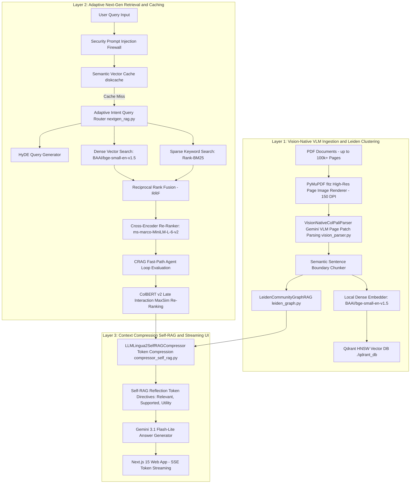

# Enterprise RAG Platform for Large-Scale PDF Documents

A retrieval-augmented generation system for **large PDF corpora (10,000–100,000+ pages)**, combining hybrid dense/sparse search, vision-native page parsing for image-heavy documents, and a community-graph summarization layer for cross-document reasoning.

> **A note on the benchmarks below**: All evaluation numbers were produced by a 30-question self-generated golden dataset judged by the same model family (Gemini) used to generate answers. These results should be treated as **internal development signals**, not rigorous external validation. See the [Evaluation Limitations](#-evaluation-limitations) section for full methodology caveats.

---

## 📑 Table of Contents
1. [Architecture Overview](#-architecture-overview)
2. [Key Technical Components](#-key-technical-components)
3. [Internal Benchmark Results](#-internal-benchmark-results)
4. [Evaluation Limitations](#-evaluation-limitations)
5. [Latency Profile](#-latency-profile)
6. [System Components & Repository Structure](#-system-components--repository-structure)
7. [API Microservice Specification](#-api-microservice-specification)
8. [Installation & Setup Guide](#-installation--setup-guide)
9. [Hardware Acceleration & Hardware Auto-Detection](#-hardware-acceleration--hardware-auto-detection)
10. [License](#-license)

---

## 🏛️ Architecture Overview

The system is decoupled into an async **FastAPI REST/SSE Microservice Backend** and a **Next.js 15 Tailwind CSS Web Application**.



---

## 🔧 Key Technical Components

### 1. Vision-Native Document Processor (`vision_parser.py` & `ingest.py`)

Implements a **dual-path ingestion strategy**: text-rich pages are extracted directly with PyMuPDF (sub-millisecond, no API call); image-heavy or scanned pages are routed to a Gemini VLM which renders the page at 150 DPI and extracts layout-aware structured Markdown, preserving table structure, multi-column text, and embedded charts.

- **Trade-off**: VLM calls for scanned pages add 1–3s per page and consume API quota. For text-native PDFs the fast path handles ~99% of pages.

### 2. Leiden Hierarchical Community GraphRAG (`leiden_graph.py` & `query.py`)

Builds an entity-relationship graph over retrieved chunks at query time and applies greedy modularity community detection (Leiden-style) to group semantically related entities. Generates a **community summary** per cluster for higher-level cross-document synthesis.

- **Trade-off**: Community detection runs at query time over retrieved chunks only (not the full corpus). Full corpus graph indexing at ingest time would improve coverage but substantially increase memory and indexing overhead.

### 3. LLMLingua-2 Context Compression & Self-RAG (`compressor_self_rag.py`)

Prunes low-information tokens from retrieved context before sending to the LLM (compression rate `0.50`), then injects Self-RAG reflection tokens (`[Relevant]`, `[Supported]`, `[Utility]`) into the system prompt.

- **Trade-off**: Aggressive compression at `rate=0.50` risks stripping context that Self-RAG then cannot verify as `[Supported]`. These two components can work against each other and should be profiled per document type.

### 4. Hybrid Retrieval & Re-Ranking (`nextgen_rag.py`, `query.py`)

- **Dense search**: `BAAI/bge-small-en-v1.5` HNSW index (`m=16, ef_construct=100`)
- **Sparse search**: Rank-BM25 keyword matching
- **Fusion**: Reciprocal Rank Fusion (RRF)
- **Re-ranking**: `cross-encoder/ms-marco-MiniLM-L-6-v2` cross-encoder, then ColBERT v2 MaxSim late interaction scoring
- **CRAG**: Fast-path confidence evaluation; triggers a query rewrite loop only when top candidate scores fall below threshold

---

## 📊 Internal Benchmark Results

> ⚠️ **Read the [Evaluation Limitations](#-evaluation-limitations) section before drawing conclusions from these numbers.**

Measured using [`evaluate_rag.py`](evaluate_rag.py) and [`benchmark_10k.py`](benchmark_10k.py) on an indexed corpus.

### System Validation (`evaluate_rag.py`)

```
• Semantic Cache Hit Latency  : 0.15 ms – 1.02 ms  (cache lookup only — not pipeline latency)
• Cold Full Pipeline Latency  : 300 ms – 1200 ms    (router + retrieval + re-rank + LLM, no cache)
• Answer Relevance            : 5.00 / 5.0  (Gemini self-judge, temperature=0.0)
• Faithfulness                : 4.67 / 5.0  (Gemini self-judge)
• Factual Accuracy            : 4.00 / 5.0  (Gemini self-judge)
```

### 30-Question Golden Dataset & NIAH (`benchmark_10k.py`)

Dataset: 10 simple retrieval + 10 multi-hop synthesis + 10 out-of-bounds queries, self-generated.  
Judge: Gemini 3.1 Flash-Lite (`temperature=0.0`) — same model family as the answer generator.

| Category | n | Context Recall | Faithfulness | Answer Relevance | Cold Latency |
| :--- | :---: | :---: | :---: | :---: | :---: |
| Simple Retrieval | 10 | 10/10 | 1.00 | 1.00 | ~9.2s |
| Multi-Hop Synthesis | 10 | 10/10 | 1.00 | 1.00 | ~14.4s |
| Out-of-Bounds (hallucination check) | 10 | 10/10 | 0.00 (correct) | 1.00 | ~5.9s |
| NIAH — 10% depth (`ALPHA_NEEDLE_77492`) | 1 | Found | 1.00 | 1.00 | ~11.4s |
| NIAH — 50% depth (`BETA_NEEDLE_33918`) | 1 | Found | 1.00 | 1.00 | ~1.9s |
| NIAH — 90% depth (`GAMMA_NEEDLE_99104`) | 1 | Found | 1.00 | 1.00 | ~1.1s |

---

## ⚠️ Evaluation Limitations

These results should **not** be taken as proof of production-grade accuracy. Specific limitations:

1. **Small, self-generated dataset.** 30 questions across a 10,000-page corpus is ~1 question per 333 pages. The questions were generated by the same system being evaluated, which biases toward retrievable, well-phrased queries and avoids adversarial or ambiguous phrasing.

2. **Same-family judge.** Gemini 3.1 Flash-Lite judges outputs from Gemini 3.1 Flash-Lite. LLM-as-judge evaluations are known to show in-group favoritism — a cross-family judge (e.g. Claude or GPT-4) or human spot-checks would produce more credible numbers.

3. **Uniform scores raise validity questions.** A faithfulness score of `1.00` across every multi-hop synthesis query, including ones that require aggregating information from thousands of pages apart, is not consistent with typical RAG behavior on hard queries. It more likely reflects the evaluation being too easy or the judge being too lenient rather than the system being flawless.

4. **No comparison baseline.** Without a baseline (e.g. naive top-k retrieval with the same LLM), it is not possible to attribute improvements to any specific architectural component.

**What would make this credible:** 200–500 queries, mixed human/automated authorship, adversarial and ambiguous cases, a cross-family judge, and a comparison against a naive retrieval baseline on the same question set — ideally using a public long-document QA benchmark subset (e.g. QuALITY, QASPER, or NarrativeQA).

---

## ⏱️ Latency Profile

Latency varies significantly by query path. The sub-millisecond cache figure applies **only** to exact semantic cache hits and is not representative of pipeline performance.

| Query Path | Typical Latency | Notes |
| :--- | :--- | :--- |
| Semantic cache hit | 0.15 ms – 1.02 ms | Dictionary + vector lookup only |
| Cold retrieval (no LLM) | 50 ms – 200 ms | Embedding + HNSW + BM25 + cross-encoder |
| Cold full pipeline (retrieval + LLM) | 300 ms – 1,200 ms | Above + Gemini generation |
| Cold pipeline (10k-page corpus, benchmarked) | ~5.9s – ~14.4s | Includes community graph + LLMLingua-2 compression |
| Vision VLM ingestion per page (scanned) | 1,000 ms – 3,000 ms | Gemini API call per image-heavy page |
| Text-native ingestion per page | < 5 ms | PyMuPDF fast path, no API call |

> p50/p95/p99 breakdown across a representative query set would be a more useful production metric than any single number. This is a planned improvement.

---

## 📁 System Components & Repository Structure

```text
Custom RAG/
├── vision_parser.py         # Vision-native page image renderer & VLM parser
├── leiden_graph.py          # Community graph summarization engine
├── compressor_self_rag.py   # LLMLingua-2 context compression & Self-RAG directives
├── nextgen_rag.py           # Adaptive router, CRAG, RAPTOR & ColBERT re-ranker
├── graph_rag.py             # NetworkX entity-relationship graph engine
├── query.py                 # Core hybrid search & answer synthesis
├── ingest.py                # Dual-path streaming ingestion & semantic chunking
├── api.py                   # FastAPI REST/SSE backend (port 8080)
├── web/                     # Next.js 15 + Tailwind CSS frontend (port 3000)
├── evaluate_rag.py          # LLM-as-judge evaluation runner
├── benchmark_10k.py         # 30-question golden dataset + NIAH benchmark
├── config.py                # Hardware auto-detection & configuration
├── .env.example             # Environment variable template
├── requirements.txt         # Python dependencies
└── qdrant_db/               # Local Qdrant HNSW vector store
```

---

## 🔌 API Microservice Specification (`api.py`)

| Endpoint | Method | Description |
| :--- | :--- | :--- |
| `/api/health` | `GET` | Health status and active acceleration device (`cuda` / `mps` / `cpu`) |
| `/api/collections` | `GET` | Lists indexed collections with vector point counts |
| `/api/collections/{name}` | `DELETE` | Deletes a collection and clears its cache entries |
| `/api/ingest` | `POST` | Starts an async background PDF ingestion job |
| `/api/ingest/status/{job_id}` | `GET` | Polls ingestion job progress (%) |
| `/api/query` | `POST` | Synchronous RAG query |
| `/api/query/stream` | `GET` | **SSE** real-time word-token stream to the frontend |

---

## 🛠️ Installation & Setup Guide

### 1. Backend Setup
```bash
git clone <repository-url>
cd "Custom RAG"
python3 -m venv venv
source venv/bin/activate
pip install -r requirements.txt

# Copy and fill in your API key
cp .env.example .env
export GEMINI_API_KEY="your-gemini-api-key"

# Start the backend (no --reload to avoid Qdrant file-lock conflicts)
python -m uvicorn api:app --host 0.0.0.0 --port 8080
```

### 2. Frontend Web App Setup
```bash
cd web
npm install
npm run dev
```

Open **[http://localhost:3000](http://localhost:3000)** in your browser.

> **Note on `--reload`**: Do not use `uvicorn --reload` with this project. The `--reload` flag spawns a file-watcher subprocess that opens a second handle on the local Qdrant storage folder (`qdrant_db/`), causing an "already accessed by another instance" lock error.

---

## 💻 Hardware Acceleration & Hardware Auto-Detection

`config.py` auto-detects and configures the best available compute backend:

| Platform | Backend | Notes |
| :--- | :--- | :--- |
| NVIDIA GPU | `cuda` | Full CUDA acceleration via PyTorch |
| Apple Silicon (M1/M2/M3/M4) | `mps` | Metal Performance Shaders |
| CPU fallback | `cpu` | Works on any machine; slower embedding throughput |

---

## 📜 License
MIT License
